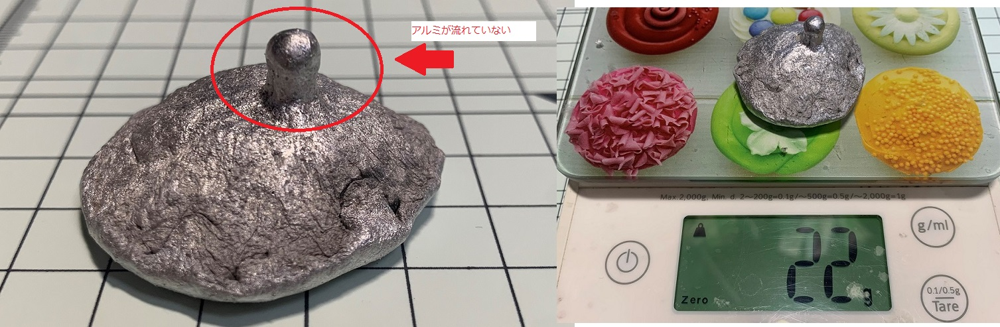

# 警告
本書にはDIY向け低圧吸引アルミニウム鋳造法について記載しています。  
溶解した金属を扱うため、試す場合は安全に作業するだけの知識が必要です。  
危険なので安易に試さないでください。  
最悪死にます。  
  
# はじめに
アルミニウムは魅惑の金属です。加工しやすく、色合いも良いです。  
また、アルミ缶を代表に様々な所に使われており、入手性も良好です。  
DIYで利用しやすい金属の代表と言えるかもしれません。  
しかし、比重が軽く湯流れが悪いため、小さなものを鋳造するのは困難です。  
下の写真は砂型＋重力鋳造法を使用し、鋳造を試みた結果です。  
アルミ缶を溶かした物を流し込んだが、アルミ湯が全く流れずに鋳造失敗しています。  
重さは22gなので、アルミ缶2本分ぐらいの量です。  
  
  
今回の取り組みでは、DIYの範囲で実現可能な低圧吸引アルミニウム鋳造法を開発し、  
なんとなくアルミを溶かしたいなという時に、気軽にアルミ鋳造を楽しめるようにしました。  

# 目次
[1. 作り方](./doc/1.How_to_make.md)  
[2. 既存の鋳造方法と今回開発した鋳造方法について](./doc/2.Casting.md)  

# 参考文献
1) アルミ鋳物（あるみいもの）とは, http://www.munegakikeigokin.com/aluminum_article/index.html
2) ダイカスト（ダイキャスト）と他の加工法の違いは？, https://www.taikennet.com/comparison.html
3) 石膏鋳造, https://www.janome.co.jp/diecast/sekko/detail.html
4) 鋳物の歴史, https://kmkc.jp/business/
5) 真空吸引鋳造, https://yoshidacast.com/%E7%9C%9F%E7%A9%BA%E5%90%B8%E5%BC%95%E9%8B%B3%E9%80%A0/
6) 低圧鋳造法, https://www.ryobi-group.co.jp/tk/products02.html
7) 鋳造方法, https://arumiimono.com/method/
8) 遠心鋳造, https://yoshidacast.com/%E9%81%A0%E5%BF%83%E9%8B%B3%E9%80%A0/
9) 鋳造方案について, https://yoshidacast.com/%e9%8b%b3%e9%80%a0%e6%96%b9%e6%a1%88%e3%81%ab%e3%81%a4%e3%81%84%e3%81%a6/
10) 加圧鋳造, https://yoshidacast.com/%E5%8A%A0%E5%9C%A7%E9%8B%B3%E9%80%A0/