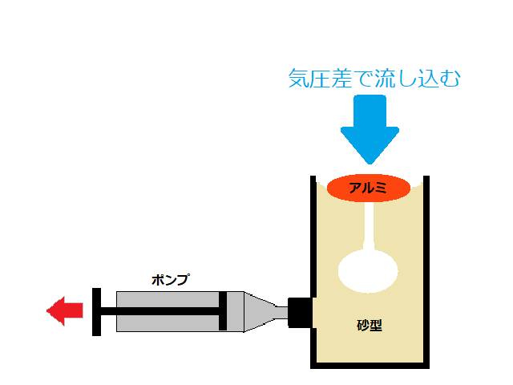
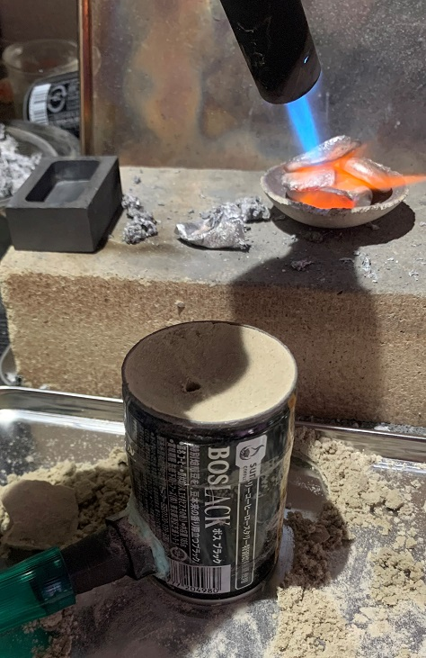
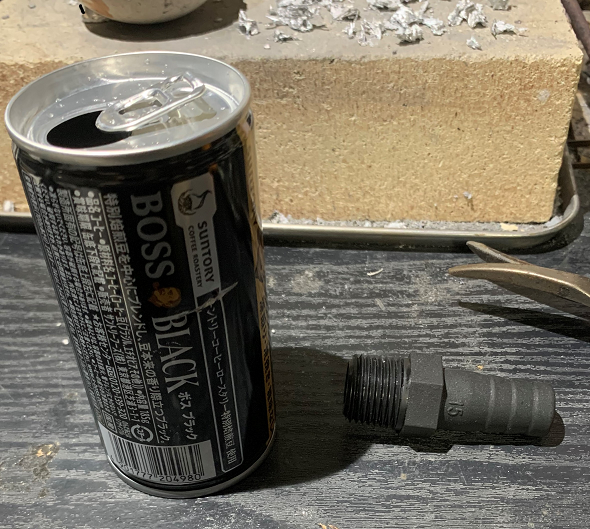
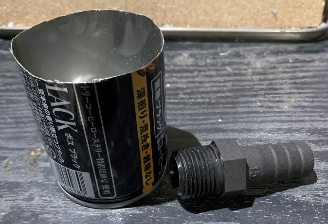
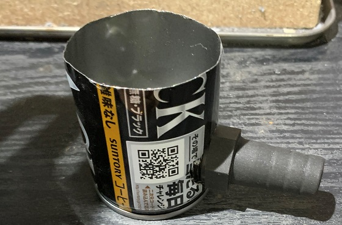
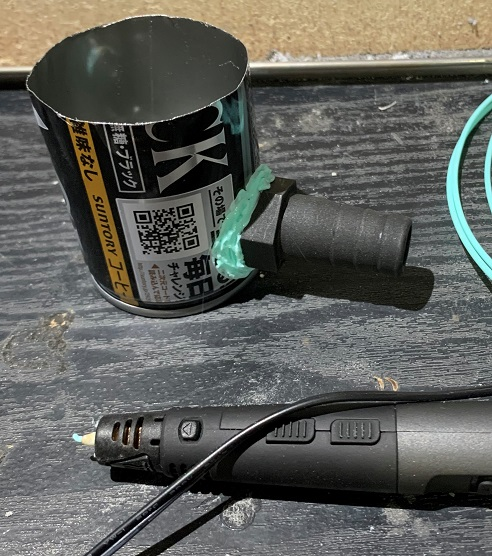
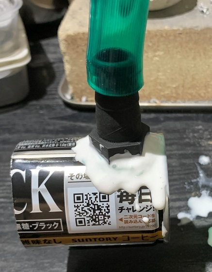
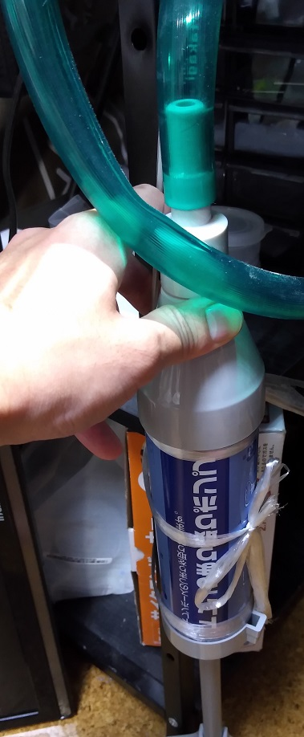

# 低圧吸引鋳造の原理
以下の図の様に手動のポンプを利用してアルミ湯を砂型に流し込む仕組みです。  
真空吸引鋳造と基本的な原理は同じです。ただしこちらは、千円程度の手動ポンプで動作するため、  
気軽に使えるというDIY的なメリットを追求しています。  
  

# 材料
・ 空き缶 （185グラム スチール缶） ： 1個  
・ ホースニップル ： 1個   
   ※ カクダイ 樹脂製ホースニップル を使用しました。  
・ 一般水道用ホース ： 1メートル  
   ※ タカギ(takagi) ホース 耐寒ソフトクリア15×20 001M 1m を使用しました。  
・ エアコン用 つまり取りポンプ ： 1個  
   ※ 早川工業 エアコン用 ドレンつまり取りポンプ を使用しました。  
・ 木工用ボンド  ： 1個  
・ 3d ペン ： 1本 ※ 無くても良い  

# 必要な工具
・ 定規  
・ ラジオペンチ  
・ 金切りばさみ  
・ 鉄やすり（中目 or 粗目）  
・ ピンバイス φ3mm ぐらい  

# 完成図

  

# 作成方法

中身を楽しんだ後、下から65mmの位置に切り取り用の線を引いてください。  
その次にホース二プルを接続する場所の確認を行ってください。  
型作成に使用する砂はホースニップル と ホースを守る断熱材になるため、  
ホース二プルの上に十分な砂を置く隙間が必要です。   
金属製のホースニップルを使用すれば熱に強くなりますが、重いため安定感が  
悪くなります。このため、樹脂製がおすすめです。  
  

ピンバイス、ラジオペンチ、金切りばさみを駆使して、2つに切ると切り口が斜めになったり、  
歪んでしまったりするので、さらに切り揃えて水平になる様に整えてください。  
次にやすりをかけて、切り口を触っても引っかからないようにします。   
  

次はホースニップルの接続です。  
ピンバイス、ラジオペンチを駆使してホースニップル接続様の穴を開けてください。  
千切る感じでラジオペンチで穴を広げればOKです。多少の隙間は埋められます。  
  

ホース二プルと缶の隙間を埋めて空気が漏れないようにします。  
隙間を埋める材料はある程度強度があればなんでも良いです。  
今回は3D PEN(PAL)で大きな隙間を埋めました。  
  

次は木工用ボンドを利用して細かな隙間を塞ぎます。  
ボンドを全面にタップリと盛り付け、上部を手で塞ぎます。  
この状態でポンプを使って空気を吸いだすことで、隙間にボンドを流し込みます。  
隙間にボンドを流し込めたら、ボンドが乾くのを待って下側の型枠完成！  
  

上側の型枠は飲み口部分を切り取り、切断面を整えるだけなので省略。  

# 使い方
左手でガスバーナー、右手でアルミ湯、足でポンプを操作します。  
このため、ポンプは机の脚に固定してください。ホースは1回ループさせておいてください。  
なるべく砂を吸い込まなくなるはずです。  
上側の型枠と下側の型枠の隙間は、セロハンテープで塞いでください。  
  
